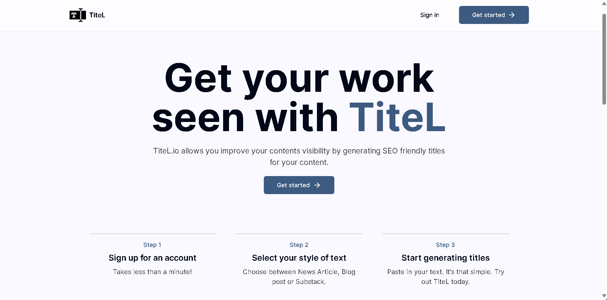

# Titel

Titel is a web application designed to generate SEO-optimized titles for given text. The application integrates with various databases and services to provide a seamless user experience.

## Table of Contents

- [Features](#features)
- [Technologies Used](#technologies-used)
- [Installation](#installation)
- [Usage](#usage)

## Features

- Generate SEO-optimized titles for articles.
- User authentication and token management.
- Integration with multiple databases and services.
- Responsive and user-friendly interface.

## Technologies Used

- **Next.js**
- **OpenAI GPT-4o**
- **Prisma**
- **Stripe**
- **Tailwind CSS**
- **TRPC**
- **Radix UI**

## Installation

1. **Clone the repository**: Download the project to your local machine.

    ```bash
    git clone https://github.com/savka777/titel.git
    cd titel
    ```

2. **Install dependencies**: Use a package manager to install all required dependencies.

    ```bash
    npm install
    ```
3. **Set up environment variables**: Create a `.env` file in the root directory and add the necessary environment variables such as API keys and database connection strings.

    ```env
    KINDE_CLIENT_ID=
    KINDE_CLIENT_SECRET=
    KINDE_ISSUER_URL=
    KINDE_SITE_URL=http://localhost:3000
    KINDE_POST_LOGOUT_REDIRECT_URL=http://localhost:3000
    KINDE_POST_LOGIN_REDIRECT_URL=http://localhost:3000/dashboard
    DATABASE_URL= "postgresql://neondb_owner..."
    DIRECT_URL= "postgresql://neondb_owner..."
    OPENAI_API_KEY=
    STRIPE_SECRET_KEY=
    STRIPE_WEBHOOK_SECRET=
    NEXT_PUBLIC_BASE_URL=
    ```

4. **Run the development server**: 

    ```bash
    npm run dev
    ```

## Usage

### Generating Titles

1. Navigate to the title generation page.
2. Enter the article text and select the article type.
3. Click "Generate Title" to receive an SEO-optimized title.

### User Authentication

- Users can sign in and sign up via the provided authentication routes.
- Token balances are managed and updated based on user actions.
